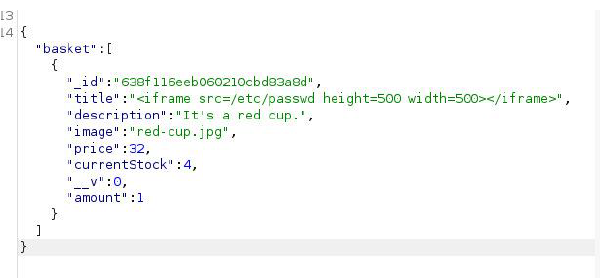

# HACKTHEBOX-stocker
A very simple, detailed, step by step write up for stocker machine on hackthebox.
## First step:
Join the machine and connect to the lab.
Connected to the machine:
<table>
  <tr>
    <td>
      
    </td>
    <td>
      
    </td>
  </tr>
</table>
I’ll create a directory named “HTB” in “/home/joxavy/Desktop” and place the downloaded OVPN file inside of it, as you can see below:

Then I’ll install OpenVPN inside that same location:

Then I will run my “. ovpn” file with OpenVPN in order to connect to it:

And as you can see below, the operation has been completed successfully:

## Second step:
Ping the machine and do some scanning

pinged with 0% packet loss.
Using “Nmap” to detect open ports or any vulnerabilities with the options -sV and -sC in order to detect both the version used and the OS.

The information obtained from this scan is as follows:

| Opened ports | Version | OS    |
|--------------|---------|-------|
| SSH, HTTP    | 8.2p1   | Linux |

Now I will add the domain that http redirects to “ http://stocker/htb” to the etc/hosts since it’s the domain we need to enumerate, which is the process that establishes an active connection to the target host (stocker in our case) to discover potential attack vectors in the system, and the same can be used for further exploitation of the system.

As you can it was added successfully:

Explore that domain name now:

## Third Step:
I’m going to use “gobuster” in order to enumerate the subdomains, as well as use “seclists” wordlists to make the job easier .
first thing I’ll do is download seclists, which is a collection of multiple types of lists used during security assessments. This includes usernames, passwords, URLs, etc.

Then I will run the go buster tool:

As you can see above, I’ve found one subdomain that is “dev.stocker.htb”.
I’ll add it to “etc/hosts” in order to explore it.

This is the resulting page:

It’s a login page.

## Fourth Step: intercept traffic
First things first I will lunch “Burp suite”
And set a manual proxy in order to intercept the upcoming traffic on Firefox:

Ill turn the burp suite intercept by going to proxy > intercept > intercept is off and turn it on

And the result above is the intercepted traffic from the site.
I’ll change the content-type to Json format to make the work easier.

<table>
  <tr>
    <td>
      
    </td>
    <td>
      
    </td>
  </tr>
</table>

Then I’ll press “forward” to get the response and see what website the request is redirecting to:

It redirects to “stock”
Which automatically shows up on the screen after I pressed forward 3 times:

Now I will turn my interceptor off and back on to intercept traffic from this site and add items to the cart, such as the red cup:

View my cart:

Submit the purchase and view the receipt:

Which directly gets intercepted in burp suite and shows up like this:

As you can see it shows the product id, the item name, price, etc.

Ill send this to the repeater in order to Send a request with varying parameter values to test for input-based vulnerabilities and turn the intercept off.

## Fifth step: search for password and username of user.
Now ill write a code to replace the title which is a server side forgery in order to try and display the passwords:

Which will display the content of “etc/passwd” instead of where the item’s title was, and “iframe” will load that page inside the current parent page.
After sending this, we get:

We copy the new order Id and paste It into the dev.stocker.htb webpage with the corresponding link and get this result:

Since we figured out earlier that through Nmap that the system is Ubuntu based on Linux, and knowing that the users in ubuntu are given an UID that starts from 1000, therefore a newly created account, will usually be give the next-highest unused number, which is going to be the UID of 1001, therefore, “angoose” is the user we are looking for.
I will use the following code snippet in order to get details of the index.js file that’s located inside the var directory which contains variable data files. This includes spool directories and files, administrative and logging data, and transient and temporary files

Press send and copy the output id I got.
Paste it into the website as we did previously and this is the result I obtained:

And from here we see the user’s password that is:

Which displays the mongodb and Node.js user connection setting
## Sixth step: connect to user’s account
Now I will connect to the user’s account:

Use the following command to see which files have root permissions:

Which shows that the files of type “.js” have the root permission therefore I will create a file .js and write a script into it in order to catch the flag using fs.readfile which is a method that’s mostly used to read the file and write the data with console.log in the terminal:

Run the file:

And as you can see, the flag has been captured !
